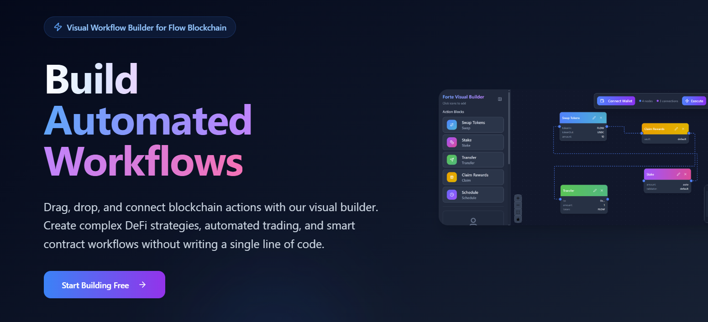

## **Flow Canvas**

Flow Actions Visual Builder is a low-code platform for composing **DeFi workflows on the Flow blockchain** through a visual interface.
Instead of writing complex Cadence scripts manually, developers and creators can **drag, connect, and configure nodes** representing on-chain actions such as token transfers, swaps, staking, or NFT operations.

The builder then **auto-generates Cadence transaction code** that can run on the **Flow Emulator, Testnet, or Mainnet**, streamlining the process from idea to execution.

### **Problem Statement**

Building on Flow often requires deep familiarity with Cadence and the Flow SDK.
This creates a barrier for:

* **Developers** who want to quickly prototype DeFi automations,
* **Designers or creators** who prefer visual tools, and
* **Teams** needing clear, auditable workflows for smart contract compositions.

Currently, there’s no **visual interface** for Flow Actions — meaning developers must manually:

* Set up transactions,
* Import contracts,
* Manage capabilities, and
* Chain multiple actions together.

This slows down iteration, increases errors, and limits experimentation with composable DeFi primitives.

### **Solution**

Flow Actions Visual Builder bridges this gap by turning **complex Cadence transactions** into **intuitive visual nodes**.

#### 🔹 Key Features

* **Visual Workflow Composer:**
  Connect nodes like “Vault Source,” “Token Sink,” or “Swapper” to build on-chain flows.
* **Auto-generated Cadence Code:**
  Each workflow generates clean, ready-to-deploy Cadence transactions.
* **Flow Emulator Integration:**
  Instantly test transactions locally without deploying on-chain.
* **Node Parameterization:**
  Configure token types, vault addresses, or min/max withdrawal directly via the UI.

By abstracting away low-level scripting, the builder allows users to **focus on logic, not syntax** — empowering both beginners and advanced developers to create DeFi actions visually.

### **Future Plan**

#### 1. **Export to Cadence**

* Enable one-click export of the generated workflow into `.cdc` transaction files.
* Provide code previews for transparency and education.

#### 2. **Workflow Templates**

* Add prebuilt templates for common flows:

  * Swap tokens (Vault → Swap → Sink)
  * Stake Flow tokens
  * Mint and transfer NFTs
* Allow users to save and share custom templates.

#### 3. **Advanced Node System**

* Introduce **Sink**, **Swapper**, and **Router** nodes to expand beyond basic token transfers.
* Add logic nodes (e.g., “If balance > X then…”).

#### 4. **Smart Contract Integration**

* Support direct contract interaction and capability borrowing.
* Connect to Flow Testnet and Mainnet environments.

